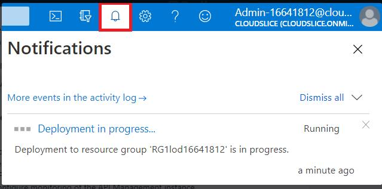
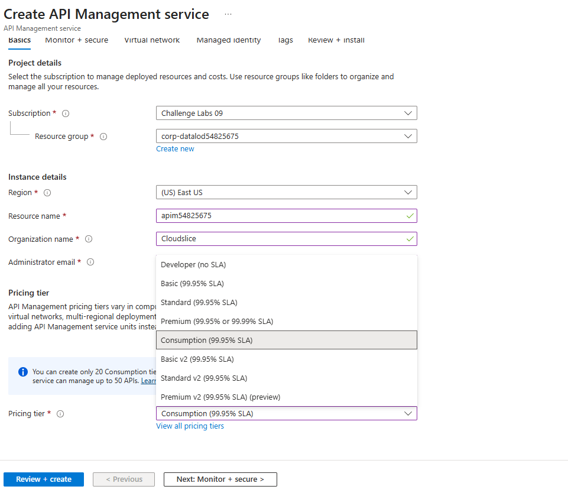
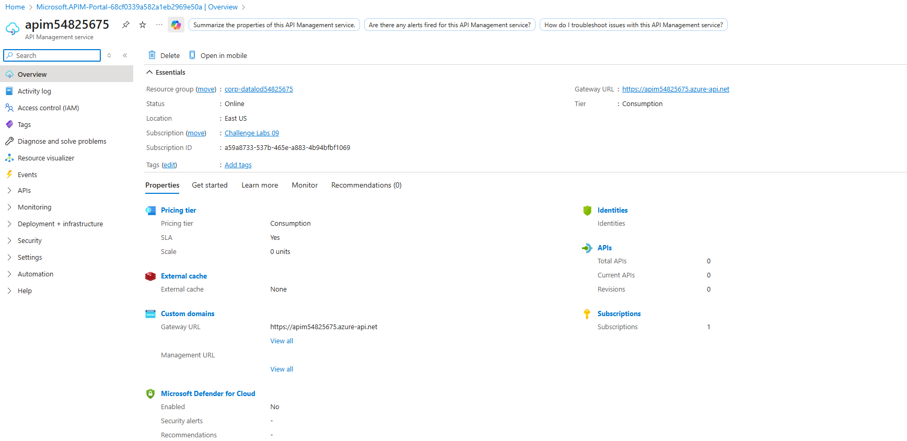
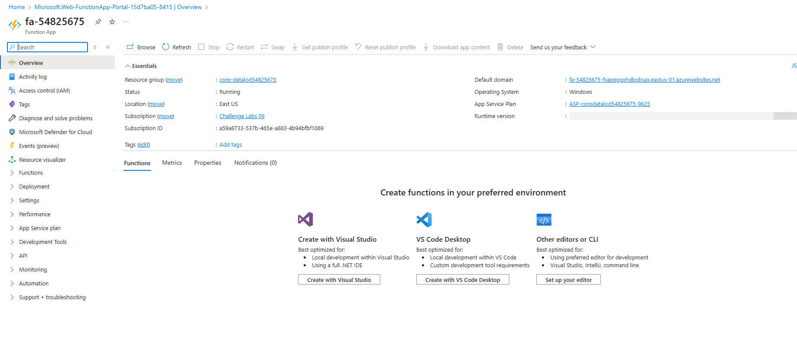

Sign in to the Azure portal as admin1-54825675@cloudslice.onmicrosoft.com using 5*DnEX*t as the password.
Select the Copy to clipboard icon to copy the text string to the clipboard.

Create a new API Management instance named apim54825675 in the corp-datalod54825675 resource group using Cloudslice as the organization name, admin1-54825675@cloudslice.onmicrosoft.com as the administrator email, and the Consumption pricing tier.
Review the following five methods of creating an API Management instance:

Azure portal
Azure PowerShell®
Azure command-line interface (Azure CLI) 2.0
Visual Studio Code
Azure Resource Manager (ARM) template
Make sure that you configure the API Management instance by using the specified values. For any properties that are not specified, use the default values.

You can monitor the progress of the deployment by using the Notifications icon.

Create a function app by using the Azure portal and the values in the following table. For all other properties, use the default value.

Property	Value
Hosting option	Consumption
Resource Group	corp-datalod54825675
Function App name	fa-54825675
Runtime stack	.NET
Version	8 (LTS), in process model
Region	East US
Storage account	New - sa54825675
Review the documentation on creating a function app.

Wait for the function app to be created before moving on to the next task. This will take approximately one minute.

Create a new function named HttpTrigger1 in fa-54825675 by using the HTTP trigger template and the Develop in portal development environment.
Review the documentation on adding a function to a function app.

Record the default (Function key) URL of HttpTrigger1 function in the following HttpTrigger1 URL text box:

HttpTrigger1 URL

You will use the URL in an upcoming step to test the HTTP function.

Review the documentation on testing a function for information on locating the logs.

Open a new browser window, go to <url> to test the HTTP trigger with the default key, that the following response is displayed in the browser window:

This HTTP triggered function executed successfully. Pass a name in the query string or in the request body for a personalized response.

Review the documentation on testing an HTTP trigger function.

Append &name=firstname to the end of the URL string in the browser address line, and then verify that the following response is displayed in the browser window:

Hello, firstname. This HTTP triggered function executed successfully.

Close the HTTP trigger test browser window.

Verify that the HttpTrigger1 Filesystem Logs in the Azure portal contain C# HTTP trigger function processed a request.

Test the HttpTrigger1 function by using the POST method, and then verify that the following response is displayed on the Output blade:

Hello, Azure. This HTTP triggered function executed successfully.