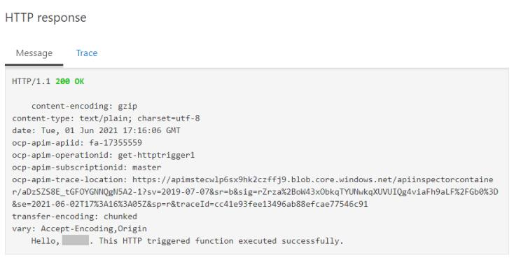
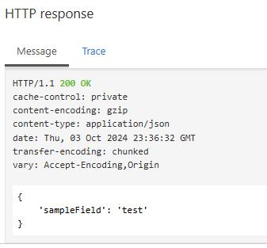

Sign in to the Azure portal as admin1-54825675@cloudslice.onmicrosoft.com using 5*DnEX*t as the password.
Select the Copy to clipboard icon to copy the text string to the clipboard.

Create a new API Management instance named apim54825675 in the corp-datalod54825675 resource group using Cloudslice as the organization name, admin1-54825675@cloudslice.onmicrosoft.com as the administrator email, and the Consumption pricing tier.
Review the following five methods of creating an API Management instance:

Azure portal
Azure PowerShell®
Azure command-line interface (Azure CLI) 2.0
Visual Studio Code
Azure Resource Manager (ARM) template
Make sure that you configure the API Management instance by using the specified values. For any properties that are not specified, use the default values.

You can monitor the progress of the deployment by using the Notifications icon.

Create a function app by using the Azure portal and the values in the following table. For all other properties, use the default value.

Property	Value
Hosting option	Consumption
Resource Group	corp-datalod54825675
Function App name	fa-54825675
Runtime stack	.NET
Version	8 (LTS), in process model
Region	East US
Storage account	New - sa54825675
Review the documentation on creating a function app.

Wait for the function app to be created before moving on to the next task. This will take approximately one minute.

Create a new function named HttpTrigger1 in fa-54825675 by using the HTTP trigger template and the Develop in portal development environment.
Review the documentation on adding a function to a function app.

Record the default (Function key) URL of HttpTrigger1 function in the following HttpTrigger1 URL text box:

HttpTrigger1 URL

You will use the URL in an upcoming step to test the HTTP function.

Review the documentation on testing a function for information on locating the logs.

Open a new browser window, go to <url> to test the HTTP trigger with the default key, that the following response is displayed in the browser window:

This HTTP triggered function executed successfully. Pass a name in the query string or in the request body for a personalized response.

Review the documentation on testing an HTTP trigger function.

Append &name=firstname to the end of the URL string in the browser address line, and then verify that the following response is displayed in the browser window:

Hello, firstname. This HTTP triggered function executed successfully.

Close the HTTP trigger test browser window.

Verify that the HttpTrigger1 Filesystem Logs in the Azure portal contain C# HTTP trigger function processed a request.

Test the HttpTrigger1 function by using the POST method, and then verify that the following response is displayed on the Output blade:

Hello, Azure. This HTTP triggered function executed successfully.

Create a product in apim54825675 by using the values in the following table. For any property that is not specified, use the default values.

Property	Value
Display name	Unlimited
Description	Unlimited
Create an API from an Azure resource named fa-54825675 in the apim54825675 API Management instance by using the fa-54825675 function app.
Review the documentation on creating an API Management instance from an existing function app.

Test fa-54825675 by using the GET method and a query parameter of name that has a value of firstname.
Review the documentation on testing an API by using the Azure portal.

The API should respond with a 200 OK message and the output shown in the following screenshot:

The test response

Create an API named Test API in apim54825675 by using the HTTP API specification.
Review the documentation on creating a test API.

Add Test API to the Unlimited product in apim54825675, and then close the Unlimited page.
Review the documentation on adding an API to an existing product.

Add an operation to Test API by using the values in the following table. For any property that is not specified, use the default values.

Property	Value
Display name	Test call
Method	GET
URL	/test
Add response	200 OK
Representations CONTENT TYPE	application/json
Representations SAMPLE	{ 'sampleField' : 'test' }
Review the documentation on adding an operation to a test API.

Add the Mock responses inbound policy to the Test call operation to set the API Management response to 200 OK.
Review the documentation on adding an inbound policy to an operation in a test API.

Test the TestAPI mock API response by using the Test call method.
Review the documentation on testing a mock API response.

The API should respond with a 200 OK message and the output shown in the following screenshot:

Secure a published API by using a product and subscription

Hints Enabled

No  Yes

Create a product in apim54825675 by using the values in the following table. For any property that is not specified, use the default values.

Property	Value
Display name	Cloudslice
Description	Test Cloudslice product
Published	Selected
APIs	fa-54825675
Review the documentation on creating a product.

Add a subscription named UserSubscription to apim54825675 for the admin1-54825675@cloudslice.onmicrosoft.com user that is scoped to the Cloudslice product.
Review the documentation on creating a subscription.

Congratulations, you completed the Can You Configure an API Management Solution? Challenge Lab.

You have accomplished the following:

Created an Azure API Management instance.
Created an Azure function app.
Created an HTTP trigger function in a function app.
Created an API by importing an existing function app.
Created a mock API in an API Management instance.
Secured a published API by using a product and subscription.
