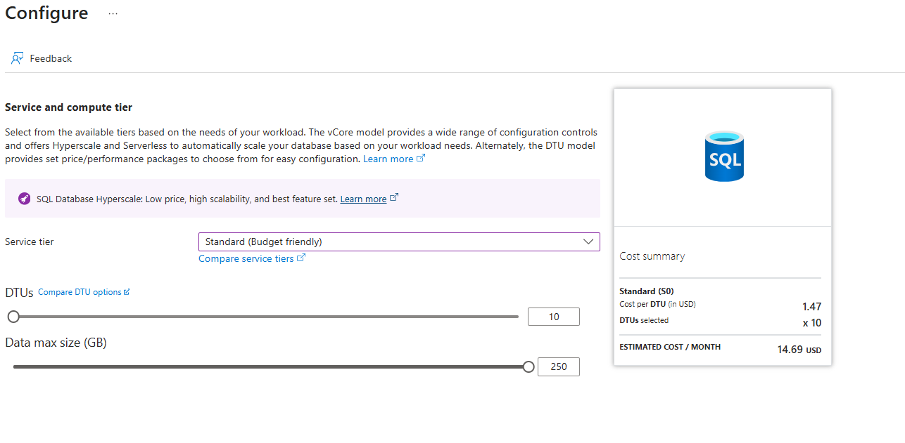
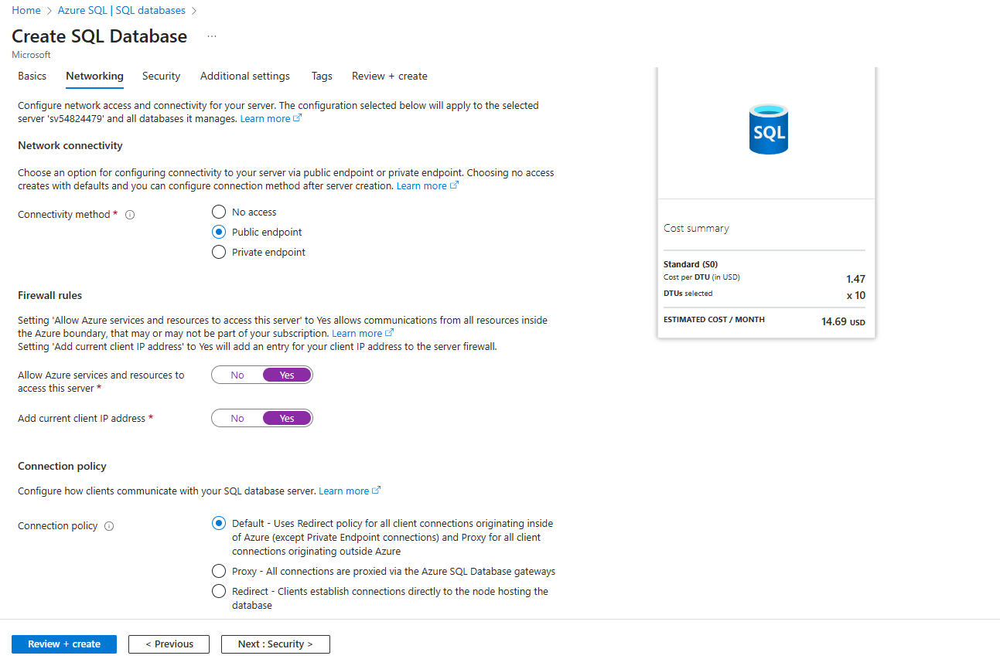
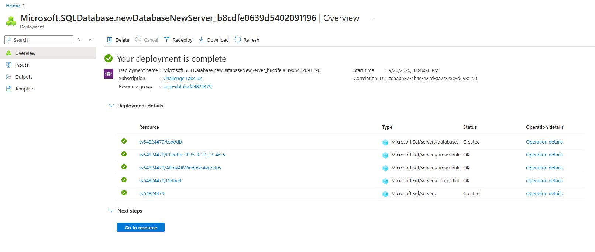
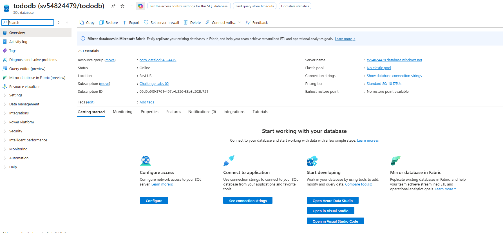
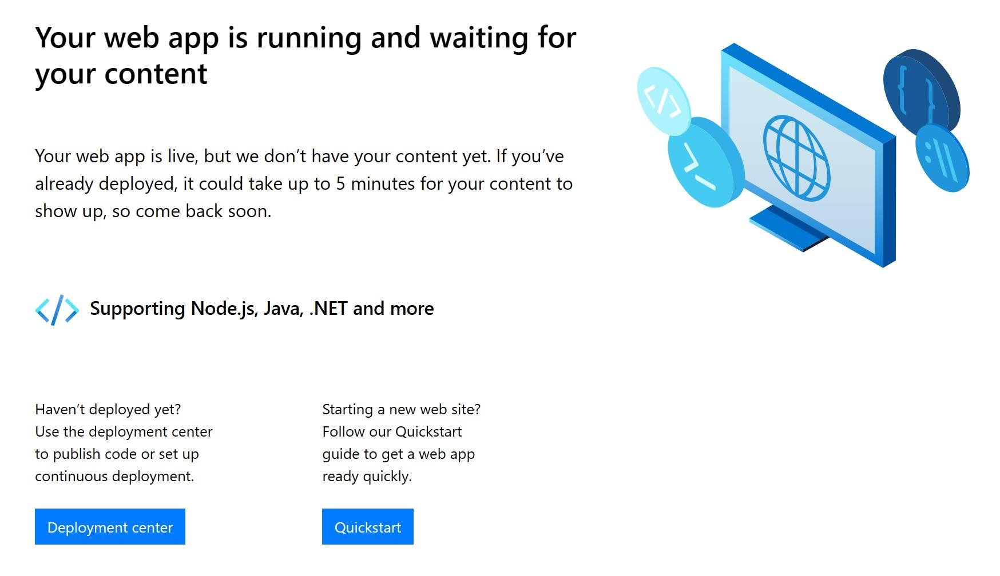
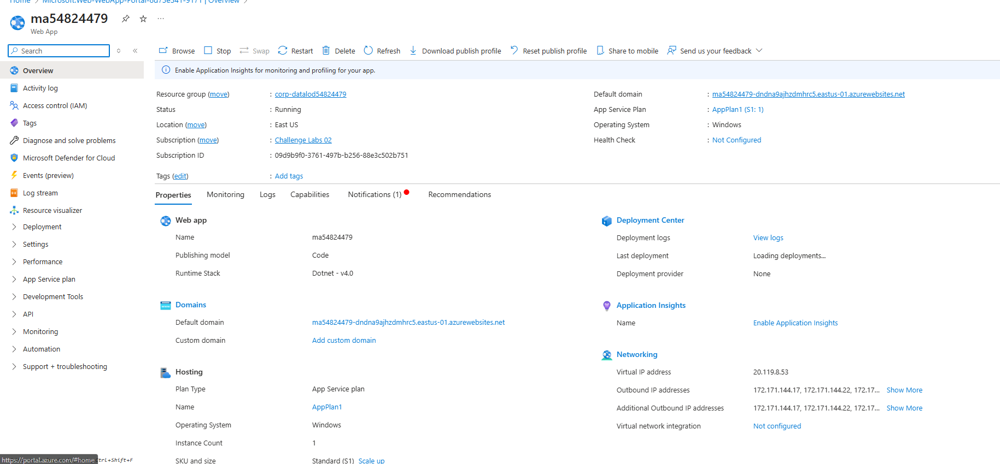
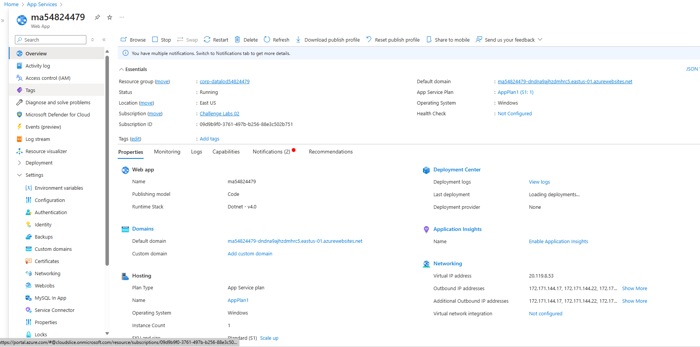
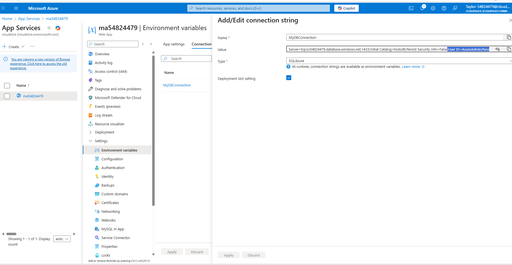
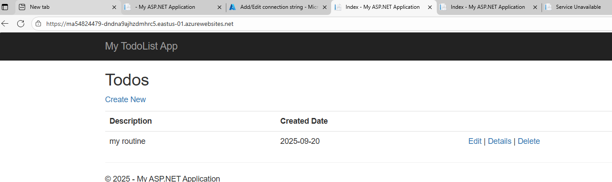

Open Microsoft Edge, sign in to the Azure portal as Taylor-54824479@cloudslice.onmicrosoft.com using Skk9grUv as the password, and then dismiss all prompts.
Select the Type Text icon to type the associated text into the current field in the virtual machine.

Create an Azure SQL Database and a new logical SQL server by using the values in the following table. For any property that is not specified, use the default value.

Property	Value
Resource group	corp-datalod54824479
Database name	tododb
Server name	Create new: sv54824479
Location	(US) East US
Authentication method	Use SQL authentication
Server admin login	AzureAdmin
Password	AzPwd54824479!
Workload environment	Development
Service tier	Standard (Budget friendly)
DTUs	10
Data max size (GB)	250
Connectivity method	Public endpoint
Allow Azure services and resources to access this server	Yes
Add current client IP address	Yes

Create an Azure Web App by using the values in the following table. For any property that is not specified, use the default value.

Property	Value
Resource Group	corp-datalod54824479
Name	ma54824479
Unique default hostname	Disabled
Publish	Code
Runtime stack	ASP.NET V4.8
Region	East US
Windows Plan (East US)	AppPlan1
Sku and size	Standard S1
Want to learn more? Review the documentation on creating an Azure mobile app back end.

Open a new Microsoft Edge browser tab, go to the URL for the new Web App at https://ma54824479.azurewebsites.net, and then verify that the default home page is displayed.

Close the Microsoft Azure App Service browser tab.

Connect to VSVM1 by using RDP, sign in as Student using AzurePa$$w0rd as the password, and then when prompted for privacy settings, select Accept.
The VSVM1 virtual machine was created for you when you launched the Challenge Lab. In this Challenge Lab, you will use VSVM1 as a developer virtual machine that hosts Visual Studio.

If prompted to allow your PC to be discoverable by other PCs and devices on this network, select No.

Want to learn more? Review the documentation on connecting to an Azure virtual machine by using RDP.

Start Visual Studio 2022 by signing in to your Microsoft work or school account as Taylor-54824479@cloudslice.onmicrosoft.com using Skk9grUv as the password and configuring it to automatically sign in to this app only.
It will take approximately 2-3 minutes for Visual Studio to open for the first time. Do not try to open Visual Studio more than once, as this will open multiple instances, which will slow things down, and then you will have to close the other instances later to release the memory used.

Wait for Visual Studio to initialize before continuing.

Want to learn more? Review the documentation on getting started with Visual Studio.

Open Windows PowerShell, and then run the following commands to clone the GitHub repo that contains the Apache Cordova mobile app solution and verify the download:

PowerShell
cd "c:\users\student\Documents\Visual Studio 2022"
PowerShell
git clone https://github.com/Azure-Samples/dotnet-sqldb-tutorial.git
PowerShell
cd ./dotnet-sqldb-tutorial/
Close Windows PowerShell.

In Microsoft Visual Studio, open the DotNetAppSqlDb project in C:\Users\Student\Documents\Visual Studio 2022\dotnet-sqldb-tutorial\DotNetAppSqlDb.
Wait for the Project to be opened.

Publish the DotNetAppSqlDb project to the existing ma54824479 Azure App Service.
Configure the profile to ignore Application Insights, and then connect the publish profile to the tododb Azure SQL database using MyDBConnection as the connection string name.
Configure the database connection string to Server=tcp:sql54824479.database.windows.net,1433;Initial Catalog=tododb;Persist Security Info=False;User ID=SQLAdmin;Password=AzureSQLPassw0rd!;MultipleActiveResultSets=False;Encrypt=True;TrustServerCertificate=False;Connection Timeout=30;, and then publish the project.
Wait for the publish operation to complete. It will take approximately 2-3 minutes.

Want to learn more? Review the documentation on publishing a Web app to Azure App Service by using Visual Studio.

When prompted, sign in as Taylor-54824479@cloudslice.onmicrosoft.com by using Skk9grUv as the password.

On the Publish page, in Hosting, in Site, select the link and confirm that the tododb web page is displayed.

If you receive an error that the application does not load, return to the Azure portal and ensure that the ma54824479 Azure App Service connection string named MyDbConnection is set to Server=tcp:sv54824479.database.windows.net,1433;Initial Catalog=tododb;Persist Security Info=False;User ID=AzureAdmin;Password=AzPwd54824479!;MultipleActiveResultSets=False;Encrypt=True;TrustServerCertificate=False;Connection Timeout=30; and SQLAzure as the type. If you still do not see the default web page, republish the app.

