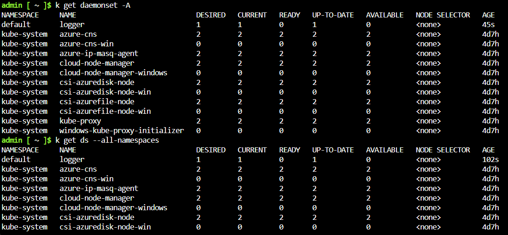

CKA.2-010: Can You Manage Kubernetes Cluster Resources? [Expert]
15 Minutes Remaining 
Create a Kubernetes Service

You have been automatically signed in to WS2019 as the administrator.

Open the MobaXterm desktop application.

Establish a new SSH session to the k8s-master1 virtual machine as the administrator using Passw0rd! as the password, and then when prompted to save the password, select No.

Select the Type Text icon to enter the associated text into the terminal.

You will perform all cluster operations in this challenge on the k8s-master1 node.

Create a Deployment named webserver by using the https://raw.githubusercontent.com/LODSContent/ChallengeLabs_Resources/master/CKA/webserver.nginx.deployment.yaml Deployment definition file.
Verify that the webserver Deployment pods are running.
Create a ClusterIP Service that internally exposes the webserver deployment on a static IP address.
Display the services that are running in the cluster, and then verify that the webserver Deployment is exposed on port 80/TCP.
Create a NodePort Service named npservice that will externally expose the pods in the webserver Deployment by using the https://raw.githubusercontent.com/LODSContent/ChallengeLabs_Resources/master/CKA/npservice.yaml NodePort definition file.
Verify that the npservice NodePort Service is running.
There are two port numbers defined by the NodePort Service. Which port number can you use to externally access the webserver application?

Port 30001

Create a pod named intranet that contains an nginx image.
Add the label department=marketing to the intranet pod.
Add the annotation Version="Beta" to the webserver deployment.
You need to determine the Selector key/value pair for the webserver Deployment. Which command should you use?

kubectl get selector webserver
kubectl describe deployment webserver
kubectl describe deployment webserver | grep pair

Manage pod scheduling

Apply the taint image=redis:NoExecute to the k8s-worker1 node.
Increase the number of pods in the webserver Deployment to 6
Verify that there are no pods scheduled to run on k8s-worker1.

The webserver pods contain an nginx image. You need to ensure that only pods that contain a redis image are running on k8s-worker1. Which command should you run?
kubectl get nodes | grep redis
kubectl get pods -o wide
kubectl get nodes | grep k8s-worker1

You plan to use the NoExecute taint effect to control pod scheduling on the k8s-worker1 node. Which statement accurately describes how the NoExecute taint effect controls pod scheduling?

Prevents pod scheduling on a node.
Allows pod scheduling on the tainted node.
Evicts pods from a node if they cannot tolerate the taint.

Schedule pods to a node

Create a Deployment named database by using the https://raw.githubusercontent.com/LODSContent/ChallengeLabs_Resources/master/CKA/ssd.deployment.yaml Deployment definition file.
Verify that you created the database deployment.
Which statement accurately describes the reason why the pods in the database Deployment are in a pending state?

None of the cluster nodes contain the key/value pair label disktype: ssd used in the pod configuration.
None of the cluster nodes have SSD drives.
The cluster nodes will not tolerate the database pods.

Update k8s-worker2 to contain the label diskType=ssd.
Verify that the database pods are running on k8s-worker2.

Deploy a DaemonSet

Create a DaemonSet named logger by using the definition file https://raw.githubusercontent.com/LODSContent/ChallengeLabs_Resources/master/CKA/logger.daemonset.yaml.
Verify that you created the logger DaemonSet.

You need to display all of the DaemonSets that are running in the cluster. Which command should you use?

kubectl get ds --all-namespaces
kubectl get daemonsets
kubectl get ds --all-daemonsets

Summary
Congratulations, you have completed the Can You Manage Kubernetes Cluster Resources Challenge Lab.

You have accomplished the following:

Created a ClusterIP Service.
Created a NodePort Service.
Labeled a resource.
Controlled pod scheduling by using taints and tolerations.
Scheduled pods to a node by using node affinity rules.
Created a DaemonSet.