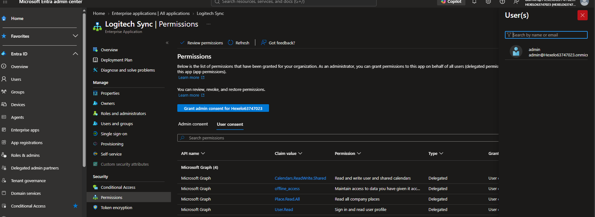
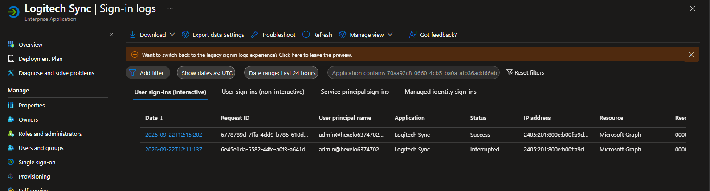
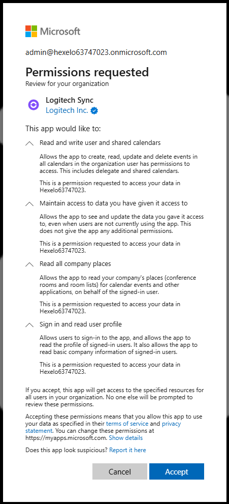

user sign in prompt when connecting to o365 from logitech sync portal

After graph api permissions are provided , we've taken back to teh logitech sync dashboard 

OFFICIAL LOGITECH GUIDE :https://hub.sync.logitech.com/syncguides/post/set-up-o365-calendar-integration-with-sync-bIQwMxjFhJJY9X0

Based on the screenshot you attached, yes, the permissions displayed by the Microsoft consent screen map directly to the Logitech requirements.

1. Permission Mapping
Consent Screen Text	Microsoft Graph PermissionRead and write to your and shared calendars	Calendars.ReadWrite.Shared ✅
Maintain access to data you have given it access to	offline_access ✅
Read all company places	Place.Read.All ✅
Sign you in and read your profile	User.Read ✅

So the consent dialog shown for Logitech Sync corresponds to all four permissions Logitech documented in their guide. The wording shown in the UI is Microsoft's user-friendly description of the Graph scopes you listed earlier.

2. About "Consent on behalf of your organization"

This is the more important part of your question.

What happens when LEFT UNCHECKED?

When you leave**"Consent on behalf of your organization"** unchecked:

Only the currently signed-in account grants consent.
Other users are not automatically granted consent to use the application.
The Logitech service account you authenticated with can continue using the app.
If another user later tries to authenticate the app, Microsoft may present the consent screen again depending on your tenant consent policies.

For your Logitech scenario, where:

You created a dedicated service account
Logitech Sync authenticates using that service account only

leaving the box unchecked is usually perfectly acceptable and often preferred from a least-privilege perspective.

What happens when CHECKED?

When checked, you're performing tenant-wide admin consent.

This means:

The permissions are granted at the tenant level.
Other users won't be individually prompted for consent for those permissions.
The app appears as approved for the organization.

This becomes more useful when:

Many users will sign into the same application.
The tenant blocks user consent.
Security/governance teams require centralized approval.

Microsoft documents that organizational consent grants the requested permissions for users in the tenant, subject to the permission type and user access.

In Your Specific Deployment

From what you've described:

✅ Dedicated Logitech service account created

✅ Room mailbox permissions delegated

✅ Logitech Sync signed in successfully

✅ Consent screen completed

✅ "Consent on behalf of organization" left unchecked

I would not consider that a problem.

For a room-booking deployment using a single dedicated service account, the app typically only needs access through that service account. There is generally no operational requirement to grant tenant-wide consent unless your security/governance process specifically wants it.

One Thing I Would Verify

Go to:

Microsoft Entra Admin Center → Applications → Enterprise Applications → Search for Logitech Sync

Check:

Application exists.
Last sign-in succeeded.
No consent-related warnings.
No Conditional Access failures.

If Logitech Sync has already imported room resources and you can see the rooms under the Sync portal, then the OAuth consent was successful and the permissions granted are sufficient.

My Assessment

I see no red flags in the screenshot.

The permissions requested exactly align with the Logitech documentation:

Calendars.ReadWrite.Shared ✅
offline_access ✅
Place.Read.All ✅
User.Read ✅

And leaving**"Consent on behalf of your organization"** unchecked is typically fine for a dedicated service-account integration such as Logitech Sync room booking. The only time I'd revisit that choice is if Logitech later reports a consent prompt issue or if organizational policy requires pre-approved tenant-wide consent.

