# Planning
A private subnet with a Storage service endpoint, storage firewall restricted to that subnet, NSGs for defense-in-depth, and two VMs to validate access paths. This architecture ensures traffic to Storage rides the Azure backbone with the subnet’s identity, while the storage firewall and NSGs collectively block everything else. One refinement: pair the storage firewall restriction with an explicit deny in the public subnet’s NSG to make the “blocked” behavior obvious at the network layer, not just at the service layer.

---

# Architecture overview

- VNet with two subnets:
  - Private subnet: Service endpoint for Microsoft.Storage enabled.
  - Public subnet: No storage service endpoint enabled.
- Storage account:
  - Public network access disabled except Selected networks.
  - Allow listed: the private subnet only.
- Network Security Groups:
  - Private NSG: allow outbound to Storage; minimal inbound; management via Bastion or just-in-time as needed.
  - Public NSG: allow inbound management from your IP; explicitly deny outbound to Storage service tag.
- Compute:
  - VM-private in the private subnet, with system-assigned managed identity.
  - VM-public in the public subnet.
- Identity and access:
  - Grant VM-private’s managed identity Storage Blob Data Reader on the storage account to test data-plane access without keys.

---

# Prerequisites

- Chosen region (keep all resources in the same region for service endpoints).
- Resource group with contributor rights.
- Azure CLI or Portal access.
- Your public IP (for management NSG rules) or Azure Bastion if you prefer no public IPs on VMs.
- Unique storage account name.

---

# Action plan

## 1) Create resource group and network

- VNet with two /24 subnets (adjust to your scheme).
- Optional: plan Bastion if avoiding public IPs on VMs.

```bash
# Variables
RG=rg-secure-storage-se
LOC=eastus
VNET=vnet-se-lab
SUBNET_PRIV=subnet-private
SUBNET_PUB=subnet-public
PRIV_CIDR=10.10.1.0/24
PUB_CIDR=10.10.2.0/24
STG=st${RANDOM}se$RANDOM   # ensure globally unique

az group create -n $RG -l $LOC
az network vnet create -g $RG -n $VNET -l $LOC --address-prefixes 10.10.0.0/16 \
  --subnet-name $SUBNET_PRIV --subnet-prefix $PRIV_CIDR
az network vnet subnet create -g $RG --vnet-name $VNET -n $SUBNET_PUB --address-prefixes $PUB_CIDR
```
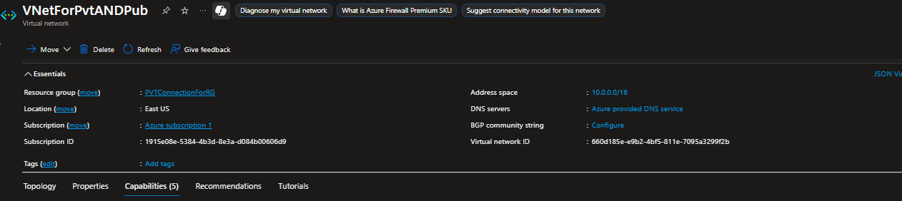

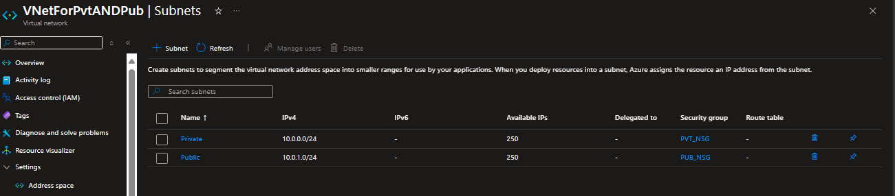
## 2) Create Network Security Groups

- Private NSG:
  - Allow outbound to Storage service tag.
  - Restrictive inbound (use Bastion or scoped RDP/SSH).
- Public NSG:
  - Allow inbound RDP/SSH only from your public IP.
  - Explicitly deny outbound to Storage service tag.

```bash
MYIP=$(curl -s4 ifconfig.me)/32

# Private NSG
az network nsg create -g $RG -n nsg-private
az network nsg rule create -g $RG --nsg-name nsg-private -n allow-out-storage --priority 100 \
  --direction Outbound --access Allow --protocol '*' --source-address-prefixes '*' \
  --source-port-ranges '*' --destination-address-prefixes Storage --destination-port-ranges '*'
# Optional: allow inbound mgmt only if needed and scoped
# Public NSG
az network nsg create -g $RG -n nsg-public
az network nsg rule create -g $RG --nsg-name nsg-public -n allow-in-mgmt --priority 100 \
  --direction Inbound --access Allow --protocol Tcp --source-address-prefixes $MYIP \
  --source-port-ranges '*' --destination-address-prefixes '*' --destination-port-ranges 22 3389
az network nsg rule create -g $RG --nsg-name nsg-public -n deny-out-storage --priority 100 \
  --direction Outbound --access Deny --protocol '*' --source-address-prefixes '*' \
  --source-port-ranges '*' --destination-address-prefixes Storage --destination-port-ranges '*'
```
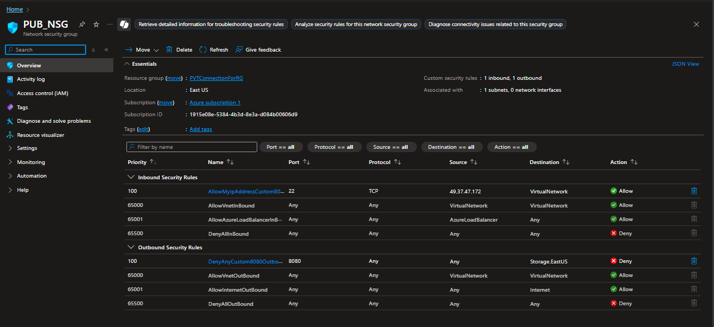

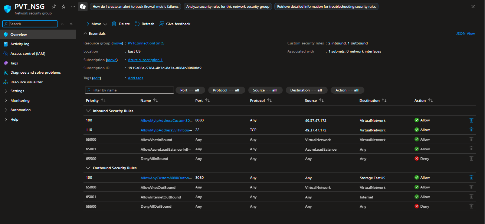

Associate NSGs to subnets:

```bash
az network vnet subnet update -g $RG --vnet-name $VNET -n $SUBNET_PRIV --network-security-group nsg-private
az network vnet subnet update -g $RG --vnet-name $VNET -n $SUBNET_PUB --network-security-group nsg-public
```
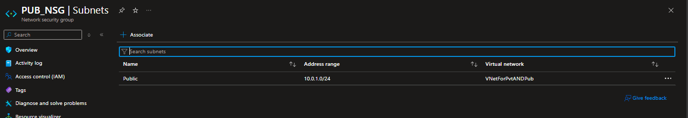

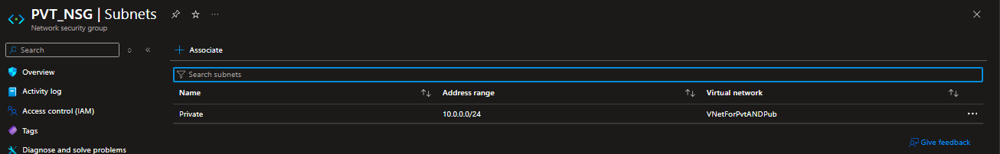
## 3) Create the storage account

```bash
az storage account create -g $RG -n $STG -l $LOC --sku Standard_LRS --kind StorageV2 \
  --https-only true --min-tls-version TLS1_2
```
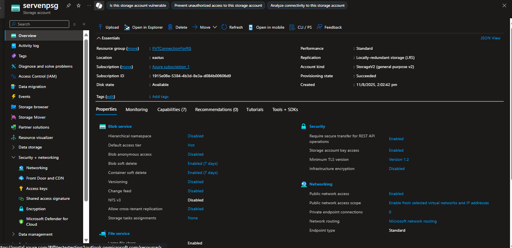

## 4) Enable service endpoint on the private subnet

```bash
az network vnet subnet update -g $RG --vnet-name $VNET -n $SUBNET_PRIV \
  --service-endpoints Microsoft.Storage
```

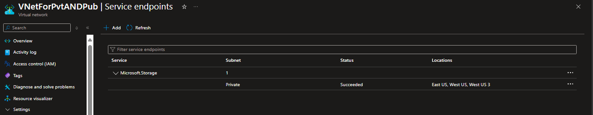

Note: Do not enable on the public subnet.

## 5) Restrict the storage firewall to the private subnet

- Set Public network access to Selected networks.
- Add the VNet/subnet (private) to the storage network rules.

```bash
# Lock to selected networks
az storage account update -g $RG -n $STG --default-action Deny

# Allow the private subnet
VNET_ID=$(az network vnet show -g $RG -n $VNET --query id -o tsv)
SUBNET_PRIV_ID=$(az network vnet subnet show -g $RG --vnet-name $VNET -n $SUBNET_PRIV --query id -o tsv)

az storage account network-rule add -g $RG -n $STG --vnet-name $VNET --subnet $SUBNET_PRIV
```
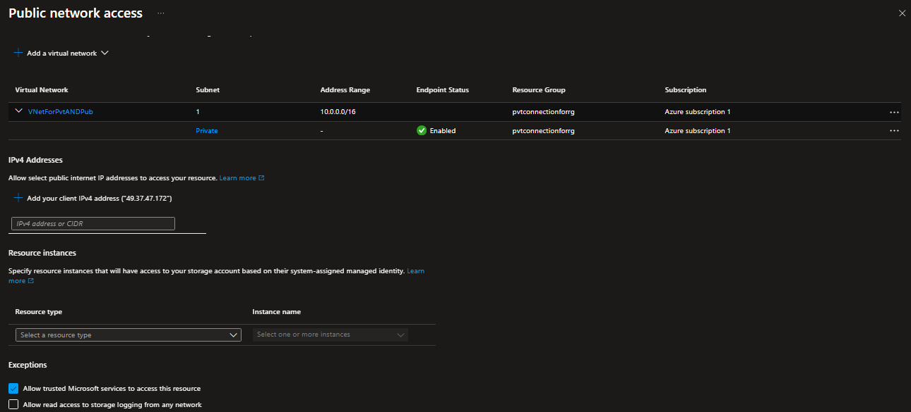

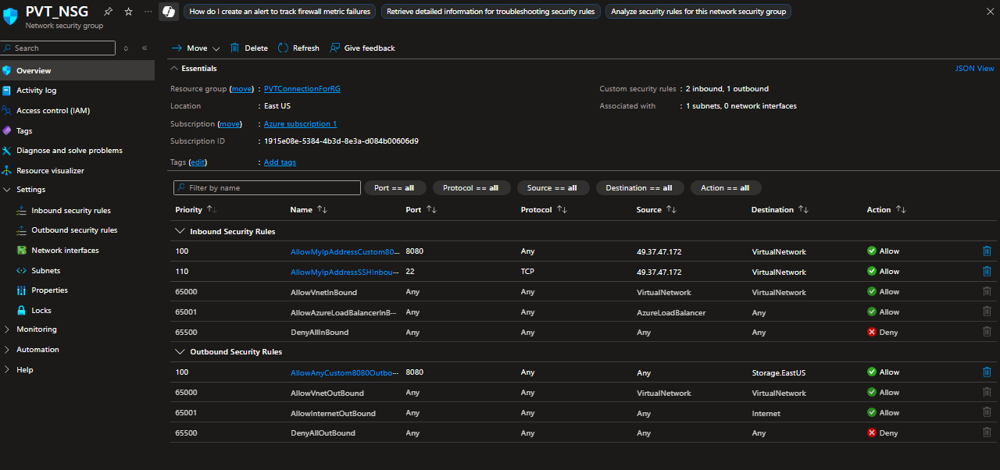

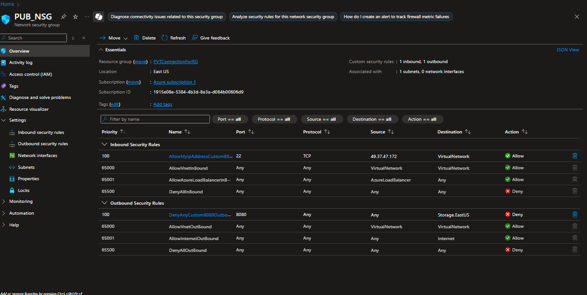
Optional hardening:
- Disable “Allow Azure services” if not needed.
- Consider service endpoint policies on the private subnet to allow only this storage account.

## 6) Create test VMs

- VM-private in private subnet (with managed identity).
- VM-public in public subnet.

```bash
# Private VM
az vm create -g $RG -n vm-private --image Ubuntu2204 --size Standard_B1s \
  --vnet-name $VNET --subnet $SUBNET_PRIV --assign-identity --generate-ssh-keys \
  --nsg ""   # already using subnet NSG

# Public VM
az vm create -g $RG -n vm-public --image Ubuntu2204 --size Standard_B1s \
  --vnet-name $VNET --subnet $SUBNET_PUB --public-ip-address "" --generate-ssh-keys \
  --nsg ""   # already using subnet NSG

# If you need direct management on vm-public, attach a public IP instead of "" and rely on the NSG allow-in-mgmt rule.
```
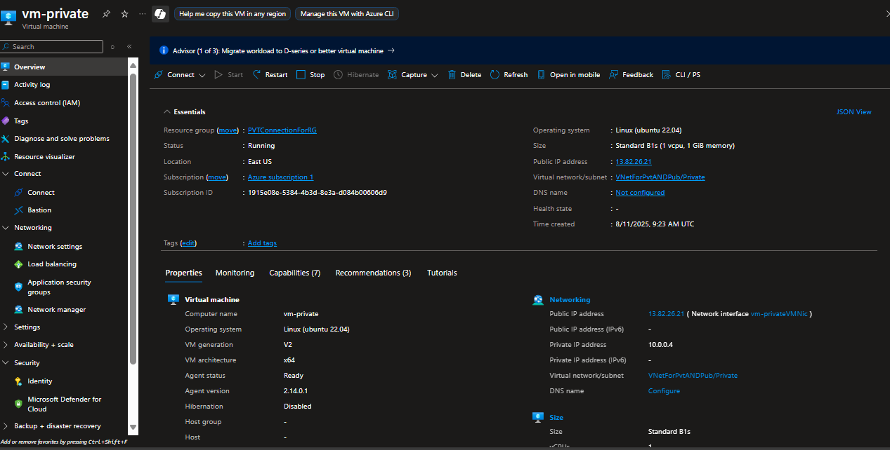

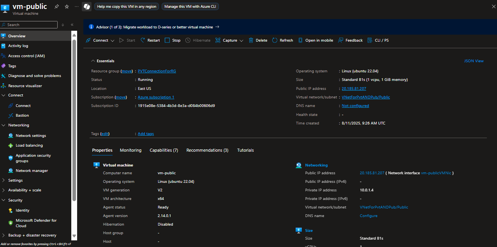

Optional: Deploy Azure Bastion to manage both VMs without public IPs.

## 7) Grant data-plane access to VM-private

Assign the VM’s system-assigned managed identity “Storage Blob Data Reader” on the storage account.

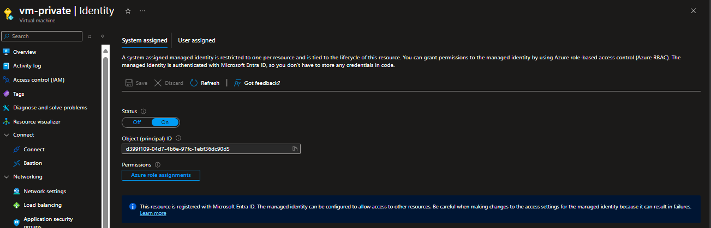


```bash
PRIV_ID=$(az vm show -g $RG -n vm-private --query identity.principalId -o tsv)
az role assignment create --assignee $PRIV_ID --role "Storage Blob Data Reader" \
  --scope $(az storage account show -g $RG -n $STG --query id -o tsv)
```
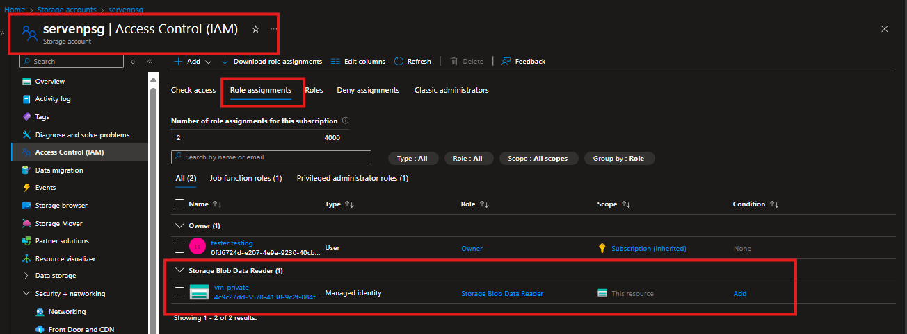

Create a test container and blob:

```bash
az storage container create --name test --account-name $STG --auth-mode login
# If running from your machine, use --account-key or az login + RBAC; for simplicity:
KEY=$(az storage account keys list -g $RG -n $STG --query [0].value -o tsv)
az storage container create --name test --account-name $STG --account-key $KEY
echo "hello from sourav" > hello.txt
az storage blob upload --account-name $STG --account-key $KEY -c test -f hello.txt -n hello.txt
```
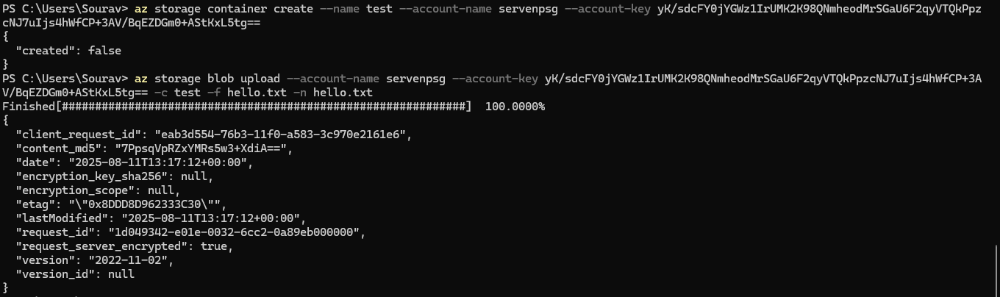

## 8) Validate connectivity

- From VM-private (private subnet, managed identity):
  - Expect success to list blobs and download.

```bash
# On vm-private
sudo apt-get update && sudo apt-get install -y azure-cli
az login --identity
az storage blob list --container-name test --account-name $STG --auth-mode login -o table
```
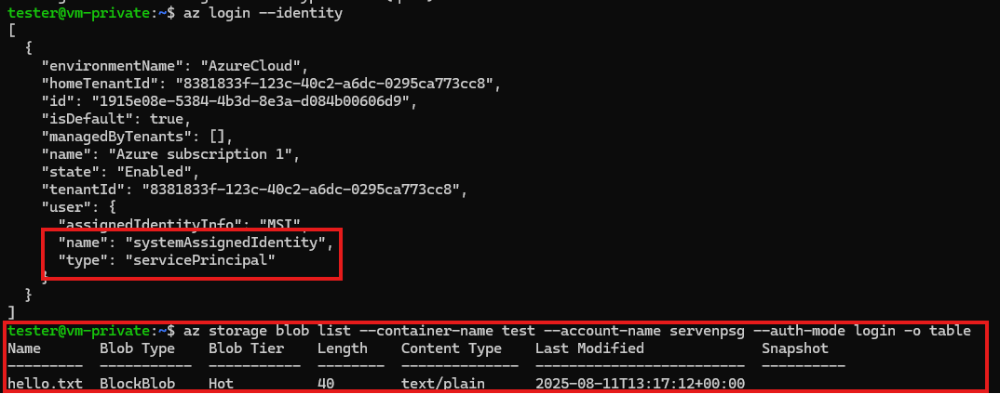

- From VM-public (public subnet):
  - Expect failure. Even DNS resolves the public endpoint, the storage firewall blocks because the subnet isn’t allowed, and the public NSG denies outbound to Storage.

```bash
# On vm-public
curl -I https://$STG.blob.core.windows.net/test/hello.txt
# Expect 403 or connection blocked; NSG deny should prevent egress if configured.
```
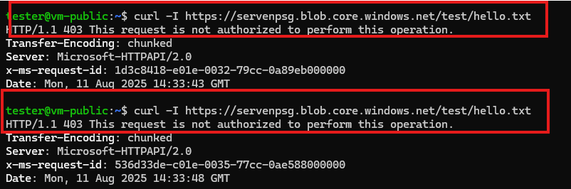

Add a quick ping to confirm general internet works from vm-public (so failure is specific to storage):

```bash
curl -I https://www.microsoft.com
```
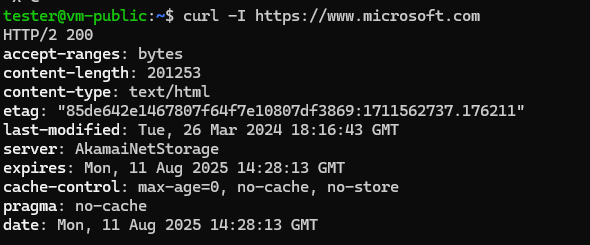

## 9) Observability and evidence

- Enable NSG Flow Logs v2 for both NSGs to a Log Analytics workspace to visualize allowed/denied flows.
- Enable Storage diagnostic settings (Blob service) to Log Analytics for auth failures.
- Capture:
  - Successful az storage blob list from VM-private.
  - Denied/blocked attempt from VM-public.
  - Screenshots of storage firewall showing only the private subnet.
  - NSG flow log snippet demonstrating Deny to Storage from public subnet.

---

# Expected outcomes

| Test case | Path | Expectation | Why |
|---|---|---|---|
| VM-private -> Storage | Private subnet with service endpoint | Success | Subnet identity allowed by storage firewall; NSG allows outbound to Storage |
| VM-public -> Storage | Public subnet, no service endpoint | Blocked | Storage firewall denies non-allowed subnets; NSG explicitly denies to Storage |
| VM-public -> Internet | Public subnet | Success (if allowed) | Confirms general egress works, so storage block is intentional |
| VM-private -> Internet | Private subnet | Success | For updates/CLI; adjust NSG if you want tighter egress |

---

# Common pitfalls to avoid

- Storage account and VNet must be in the same region for service endpoints to apply.
- After enabling service endpoints, allow a few minutes for propagation before testing.
- Don’t accidentally enable “Allow public network access” to All networks; keep it on Selected networks.
- Ensure you didn’t add the public subnet to storage network rules.
- If using user-defined routes with a virtual appliance, ensure no UDR breaks service endpoint traffic.

---

# Optional hardening

- Replace service endpoints with Private Endpoints for private IP to storage and stricter isolation.
- Add Service Endpoint Policies on the private subnet to allow only your specific storage account(s).
- Use Azure Bastion instead of public IPs for VM management.
- Lock down outbound with Azure Firewall or a NAT gateway with FQDN tags if you need granular egress control.

