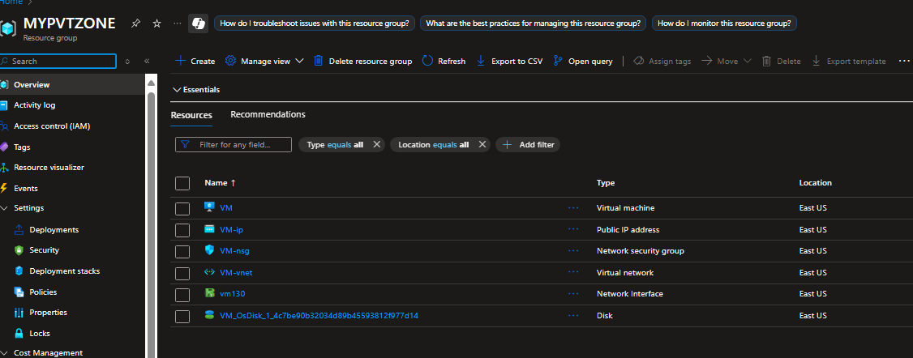
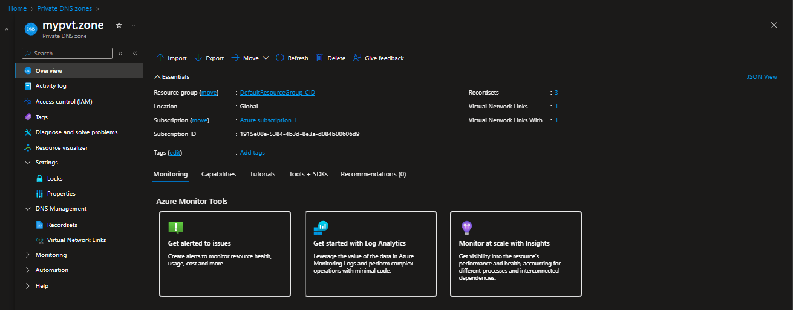
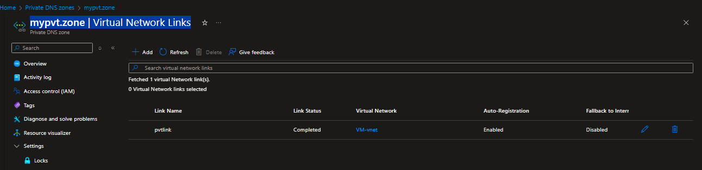
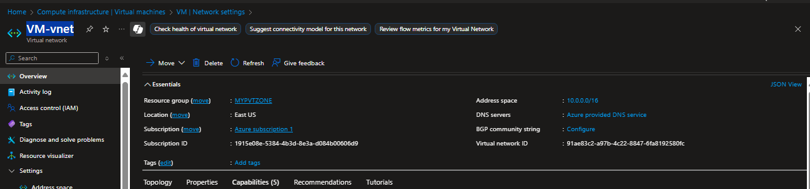
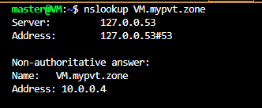
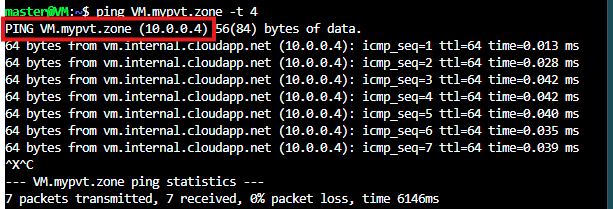

AZURE PRIVATE DNS ZONE CREATION AND TESTING

Here’s how you can **create a Private DNS zone**, deploy a **VM within it**, and **test its name resolution** using Azure CLI. I’ve laid it out clearly so you can follow along step-by-step:

---

## 🔧 Step 1: Create a Resource Group
```bash
az group create --name MyResourceGroup --location eastus
```

---

## 🌐 Step 2: Create a Virtual Network and Subnet
```bash
az network vnet create \
  --resource-group MYPVTZONE \
  --name MyVNet \
  --address-prefix 10.0.0.0/16 \
  --subnet-name MySubnet \
  --subnet-prefix 10.0.1.0/24
```

---

## 📛 Step 3: Create a Private DNS Zone
```bash
az network private-dns zone create \
  --resource-group MYPVTZONE \
  --name mypvt.zone
```

---

## 🔗 Step 4: Link the VNet to the Private DNS Zone
```bash
az network private-dns link vnet create \
  --resource-group MYPVTZONE \
  --zone-name mypvt.zone \
  --name MyDNSLink \
  --virtual-network MyVNet \
  --registration-enabled true
```

> 💡 Enabling registration automatically adds A records for VMs in the VNet.

---

## 💻 Step 5: Create a VM Within the VNet
```bash
az vm create \
  --resource-group MyResourceGroup \
  --name VM \
  --vnet-name VM-vnet \
  --subnet default \
  --image UbuntuLTS \
  --admin-username master \
  --generate-ssh-keys
```

---

## 🧪 Step 6: Test DNS Resolution Inside the VM

### Connect to the VM
```bash
ssh azureuser@<public-ip-of-TestVM>
```

### Use `nslookup` or `dig`
```bash
nslookup VM.mypvt.zone
```
Or:
```bash
dig VM.mypvt.zone
```


You should see the internal IP returned by the DNS zone 🔍


---

## ✅ Quick Validation Table

| Component                    | Goal                                 | Expected Result                       |
|-----------------------------|--------------------------------------|----------------------------------------|
| Private DNS Zone            | DNS management for internal names    | Zone `myinternaldomain.local` created  |
| VNet Link                   | Connect DNS zone with VNet           | Auto-registration enabled              |
| VM Deployment               | Resource with internal DNS identity  | VM running inside `MyVNet`             |
| DNS Lookup from VM          | Confirm name resolution works        | Internal IP returned for domain        |

---

If you’re planning to scale this setup—for example using **multiple VMs**, **custom DNS records**, or **service discovery for Azure Functions or containers**—I’d be happy to guide you further. Want to go deeper?
